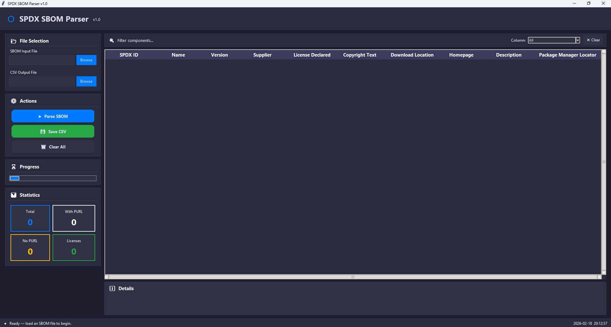

# SPDX SBOM Parser GUI

A clean, modern desktop GUI tool to parse **SPDX SBOM files** (Software Bill of Materials) and export them to CSV.

Supports the three main SPDX file formats:

- JSON (`*.json`, SPDX 2.2 / 2.3 / 3.0 style)
- Tag-Value / .spdx (`*.spdx`, `*.tv`)
- XML (`*.xml`, legacy SPDX format)

The parser extracts the most useful package-level fields and cleans them for readability.

  


## Features

- Drag & drop or browse to select SPDX file
- Table view of all extracted components/packages
- Cleaned supplier names (removes "Person:", "Organization:", "Tool:" prefixes)
- Package-Manager locators (npm, pypi, maven, etc.) shown in one column
- One-click export to clean CSV
- Dark modern UI with rounded buttons and responsive layout

## Extracted Fields

| Column                    | Description                                      |
|---------------------------|--------------------------------------------------|
| SPDX_ID                   | Package SPDX identifier                          |
| Name                      | Package name                                     |
| Version                   | Version string                                   |
| Supplier                  | Cleaned supplier / author                        |
| License_Declared          | Declared license                                 |
| Copyright_Text            | Copyright statement                              |
| Download_Location         | Download URL                                     |
| Homepage                  | Project homepage                                 |
| Description               | Package description                              |
| Package_Manager_Locator   | Package manager coordinates (PURL-like)          |

## Requirements

- Python 3.8+
- tkinter (usually comes with Python)
- No external pip packages required!

## Installation & Usage

1. Clone the repository

   ```bash
   git clone https://github.com/dipta-roy/spdx_sbom_parser.git
   cd spdx_sbom_parser
   ```

2. Run the GUI

   ```bash
   python sbom_parser_gui.py
   ```

   or on some systems:

   ```bash
   python3 sbom_parser_gui.py
   ```

3. In the app:
   - Click **Browse** or drag & drop an SPDX file
   - Wait for parsing to complete
   - View results in the table
   - Click **Export to CSV** to save

## Supported SPDX Formats

| Format     | Extension       | Status      | Notes                                 |
|------------|-----------------|-------------|---------------------------------------|
| JSON       | `.json`         | Full        | Most common today (SPDX 2.2+)         |
| Tag-Value  | `.spdx`, `.tv`  | Full        | Classic SPDX format                   |
| XML        | `.xml`          | Full        | Older SPDX-RDF/XML format             |

Other formats (tag-value with different extensions, SPDX 3.0 YAML, etc.) are **not** supported yet.

## License

CC0 1.0 Universal

## Author

Dipta Roy  
Released: February 2025
